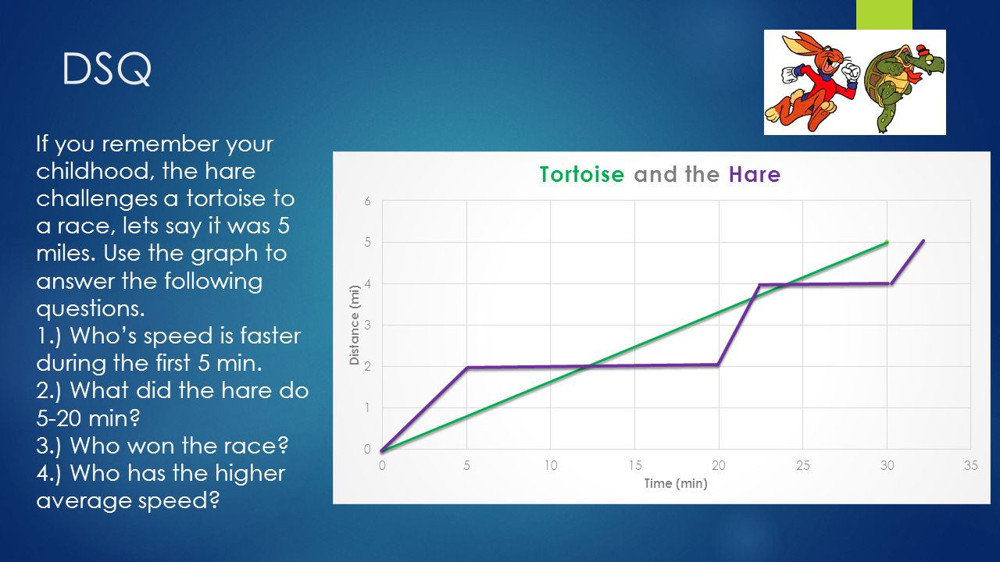

# Kunal's Challenge

## User Story

```
AS A person interested in athletes
I WANT a program that simulates runners
SO THAT I can predict who will win.
```

## Acceptance Criteria

```
GIVEN I need a function that will output who wins
WHEN I open the app,
THEN I can view information about each human and each race
WHEN I view information about each human,
THEN I can see and change each human's metadata including speed and stamina
WHEN I view information about each race,
THEN I can see and change the race distance
WHEN I press a button to start the races,
THEN I will see which human won each game
```

### Pseudocode

```
tortoise run style will have constant speed over time

hare run style will be faster than tortoise but will randomly take breaks

```

<!-- inspiration from https://slideplayer.com/slide/9391123/ -->


