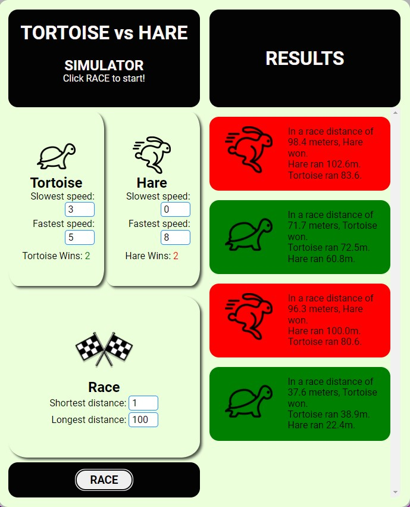

# Tortoise VS Hare

## Introduction

Simulation is an important part of computer science as it allows visualization of a concept to make a relationship easier to see. Tortoise VS Hare

This was a challenge given to me by a tutor at bootcamp.

## Usage

Go to [Tortoise vs Hare](https://leoelicos.github.io/bcs-04-tortoise-vs-hare/) to see the deployed app.

## Screenshot

### Tortoise VS Hare



## Credits

Kunal, BCS Tutor

## User Story

```
AS A person interested in athletes
I WANT a program that simulates runners
SO THAT I can predict who will win.
```

## Acceptance Criteria

```
GIVEN I need a function that will output who wins
WHEN I open the app,
THEN I can view information about each human and each race
WHEN I view information about each human,
THEN I can see and change each human's metadata including speed and stamina
WHEN I view information about each race,
THEN I can see and change the race distance
WHEN I press a button to start the races,
THEN I will see which human won each game
```

## Licence

[MIT Licence 2022](./LICENSE)

Copyright Leo Wong 2022
